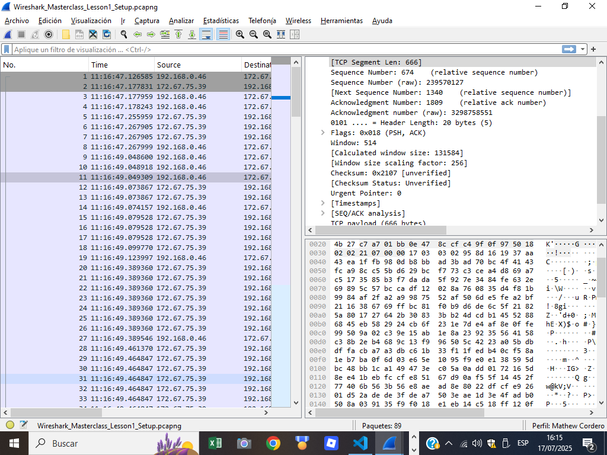

# INFORME DE LABORATORIO - REDES DE COMPUTADORAS Y ANÁLISIS DE PAQUETES

---

## INFORMACIÓN DEL DOCUMENTO

| Campo | Detalle |
|-------|---------|
| **Fecha** | [10/07/2025] |
| **Preparado por** | [Mathew Cordero Aquino] |
| **Asignatura** | Redes de Computadoras |
| **Actividad** | Laboratorio - Red Humana y Análisis de Paquetes |

[INFORME PDF](./informe_lab1parte1.pdf)

---

## RESUMEN EJECUTIVO

**Resumen:** Análisis experimental de esquemas de comunicación históricos y modernos, incluyendo transmisión de códigos Morse y Baudot, así como análisis de paquetes con Wireshark.


**Objetivo Principal:**
Comprender los fundamentos de la transmisión de información y familiarizarse con herramientas de análisis de red como Wireshark.


---

## INTRODUCCIÓN

### Propósito del Laboratorio
Este laboratorio tiene como finalidad introducirnos a la ciencia de enviar información mediante actividades prácticas que nos permitan:
- Identificar ventajas y desventajas de distintos esquemas de comunicación
- Comprender la complejidad al momento de enviar información
- Conocer las bases de un conmutador a pequeña escala
- Familiarizarse con herramientas de análisis de paquetes como Wireshark

### Alcance

**Incluye:**
- Transmisión de códigos Morse y Baudot
- Comunicación empaquetada mediante notas de voz
- Implementación de sistema de conmutación
- Análisis de paquetes con Wireshark

**Excluye:**
- Implementación de hardware real
- Análisis de protocolos avanzados
- Configuración de redes empresariales

### Metodología

| Actividad | Descripción | Herramienta |
|-----------|-------------|-------------|
| **Transmisión Directa** | Envío de mensajes usando código Morse y Baudot | Comunicación oral/Zoom |
| **Transmisión Empaquetada** | Envío mediante notas de voz | WhatsApp/Discord |
| **Conmutación** | Sistema de retransmisión de mensajes | Topología de red humana |
| **Análisis de Paquetes** | Captura y análisis de tráfico de red | Wireshark |

---

## DESARROLLO Y RESULTADOS

### Parte 1: Transmisión de Códigos (Morse vs. Baudot)

#### Descripcion 


Para esto se uso el codigo de [Morse](./morse.py)  donde se ejecutaron los sonidos de los . y -  tambien [Badout](./badout.py) para generar estos sonidos pero con 2 y 3 para 0 y 1 respectivamente, el 0 es el mas grave y 1 el mas agudo.


#### Datos Experimentales
- **Código Morse** - [3 codigos]
- **Código Baudot** - [3 codigos]
- **Tiempo promedio** - [0.4 segundos]
- **Tasa de errores** - [10%]

#### Mensajes


JAVIER CHEN
- . .... - --- -.-- - -.-. .- .-           → E H T O Y T C A A    (original: ESTOY ACA)

- . .... - --- -.-- . -. -.-. .- ... .-     → BUEONS DIAS         (original: BUENOS DIAS)

- -.-. --- -- --- . ... - .-                → COMO ESTA           (original: COMO ESTAS)


- 11000 01011 01010 10000 10101 01010 10101 → EHTOYTCAA       (original: ESTOY ACA)

- 11000 01011 01010 10000 01010 11000 01011 → BUEONS DIAS     (original: BUENOS DIAS)

- 10101 00110 01010 10000 10101            → COMO ESTA       (original: COMO ESTAS)


MATHEW:

- .--. .. -. -.-. .... . -.-. . .-.          → PINCHE CHER         (original: PINCHE CHEN)

- -.-. --- -- --- . ... - .-                → COMO ESTA           (original repetida)

- .... --- .-.. .- .- - --- -.. --- ...      → HOLAA A TODOS       (duplicación de A, 
errores leves)


- 01010 10101 10000 10101 01010 10101 01010 → PINCHE CHER     (original: PINCHE CHEN)

- 10101 00110 01010 10000 10101            → COMO ESTA        (original repetida)

- 01010 00101 01010 10000 01010 01010 01010 → HOLAA A TODOS    (duplicación y ruido)


#### Medio usado


#### Análisis Comparativo
**Preguntas de reflexión:**
1. **¿Qué esquema es más fácil?** 

El esquema mas facil fue el de morse ya que no habia tanta estructura y era mas intuitivo sin embargo al traducir fue el que mas costo debido al tiempo que se toma

2. **¿Con cuál ocurren menos errores?**

Con el que ocurrieron menos errores son con el Baudot , debido a que era mas facil de codificar, y tenia mejor estructura 


### Parte 2: Transmisión "Empaquetada" (Notas de Voz)
| Mensaje                           | Código Utilizado | Errores Detectados | Interpretación    | Error Detectado                                  |
| --------------------------------- | ---------------- | ------------------ | ----------------- | ------------------------------------------------ |
| [Mensaje 1](./badout/badout1.wav) | Baudot (.wav)    | SI Sí               | **CARACOLES AMA** | "ANA" mal transmitido como "AMA" (error en la N) |
| [Mensaje 2](./badout/badout2.wav) | Baudot (.wav)    | SI Sí               | **PAN HARIDANO**  | Letras D y N intercambiadas al final             |
| [Mensaje 3](./badout/badout3.wav) | Baudot (.wav)    | SI Sí               | **NARANCA ARROZ** | "G" mal interpretada como "C" en "NARANCA"       |


#### Medio usado

Se utilizo whatsapp para poder enviar los mensajes


#### Dificultades Identificadas
**Pregunta de reflexión:**
- **¿Qué dificultades involucra el enviar un mensaje de esta forma "empaquetada"?**
El problema es que muchas veces en whatsapp no llega el audio completo, se corrompe o puede perderlo la otra persona, tambien suele ocurrir que al no estar controlado por el usuario sino que se genero por codigo esto provoco que costara un poco mas leer. Lo cual lo hizo mas propenso a errores

### Parte 3: Conmutación de Mensajes

#### Configuración del Sistema

**Clientes:** Rodrigo, Javier 

**Conmutador:** Mathew

**Protocolo acordado:** 


La manera en como funciona es la siguiente primero el cliente manda un mensaje para preguntar si se puede enviar mensajes al servidor esto indicando formato B[si es baudot] y J [si es morse]  luego una T 

**B/J  espacio de 4 segundos    T**

El servidor responderia con un mismo mensaje pero en vez de la T puede ser un F que es rechazado si envia T es que pueden venir nuevos mensajes

**B/J  espacio de 4 segundos    T/F**


Luego el cliente mandara su mensaje que sera de la siguiente manera:  B/J para el tipo de codificacion, Origen quien fue quien lo envio y Destino que a quien va

**B/J  espacio de 4 segundos    ORIGEN espacio de 4 segundos MENSAJE  espacio de 4 segundos DESTINO**

Los clientes se identifican por una letra de su nombre

- M de Mathew
- R de Rodrigo
- C de Javier Chen


#### Audios Generados

Como Rodrigo no tenia el programa lo que hicimos fue utilizar voz

MORSE
- La barra "-" se decia Oooooooo
- El punto "." se decia o una vez

BADOUT

- El 1 se decia "A"
- El 0 se decia "O"


#### Medio Usado

- Javier Chen envio un mensaje al conmutador pidiendo en badout permisos


- Rodrigo envio un mensaje al conmutador pidiendo en morse permisos


- El conmutador acepto el de Javier 


- El conmutador rechazo el de Rodrigo


- Chen envio un mensaje


El mensaje decia "B C hola R"
osea use Badout como codificador, viene de Chen el mensaje es "hola" y el destinatario es Rodrigo


- El conmutador lo leyo 
```plaintext


AAOAO AAAOO AAOAA AOOOO OAOAA

h o l a 


B  C hola R


```

-El conmutador lo envio a Rodrigo


#### Análisis del Sistema de Conmutación
**Preguntas de reflexión:**

1. **¿Qué posibilidades incluye la introducción de un conmutador en el sistema?**

Un gestor que se encargue de manejar concurrencia de mensajes, tambien que pueda ver el destinatario y asi varios clientes se conectan al mismo. Y ya no es necesario que existan conexiones individuales sino que por un mismo puerto todos se comuniquen con todos

2. **¿Qué ventajas/desventajas se tienen al momento de agregar más conmutadores al sistema?**

La ventaja es que llega a ser muchisimo mas rapido, cuando existen mas conmutadores se crea paralelismo y por ende la carga de trabajo es menor en cada uno , la desventaja es que el paralelismo conlleva que existan mecanismos de sincronización y coordinación entre los conmutadores, especialmente para evitar colisiones, bucles de red o inconsistencias en el enrutamiento de datos. También puede aumentar la complejidad del mantenimiento, configuración y monitoreo del sistema, así como los costos asociados al hardware adicional.


### Parte 4.1: Wireshark


1.Descargue el archivo https://www.cloudshark.org/captures/e6fb36096dbb (Export ->
Download)


2. Cree un perfil (Configuration -> Profiles) con su primer nombre y primer apellido


3. Abra el archivo descargado (File -> Open)


4. Aplique el formato de tiempo Time of Day a la columna Tiempo (View -> Time Display)


5. Agregue una columna con la longitud del segmento TCP (Selecciona la primera fila, en
el panel despliegue Transmission Control Proto inferiorcol, seleccione TCP Segment Len
y apliquelo como una columna)


6. Elimine u oculte la columna Longitud


7. Aplique un esquema de paneles que sea de su preferencia (que no sea el esquema por
defecto)




8. Aplique una regla de color para los paquetes TCP cuyas banderas SYN sean iguales a 1,
y coloque el color de su preferencia (View -> Coloring Rules)


9. Cree un botón que aplique un filtro para paquetes TCP con la bandera SYN igual a 1.


10. Oculte las interfaces virtuales (en caso aplique


### Parte 4.2: Wireshark

En la segunda parte, se realizará una captura de paquetes con un ring buffer.


1. Abra una terminal y ejecute el comando ifconfig/ipconfig (dependiendo de su SO).
Detalle y explique lo observado, investigue (i.e.: ‘man ifconfig’, documentación) de ser
necesario. ¿Cuál es su interfaz de red?


Mi interfaz es wifi


2. Luego, retornando a Wireshark, desactive las interfaces virtuales o que no aplique.


3. Realice una captura de paquetes con la interfaz de Ethernet o WiFi con una
configuración de ring buffer, con un tamaño de 5 MB por archivo y un número máximo
de 10 archivos (Capture -> Options -> Output) Genere tráfico para que los archivos se
creen. Defina el nombre de los archivos de la siguiente forma: lab1_carnet.pgcap


